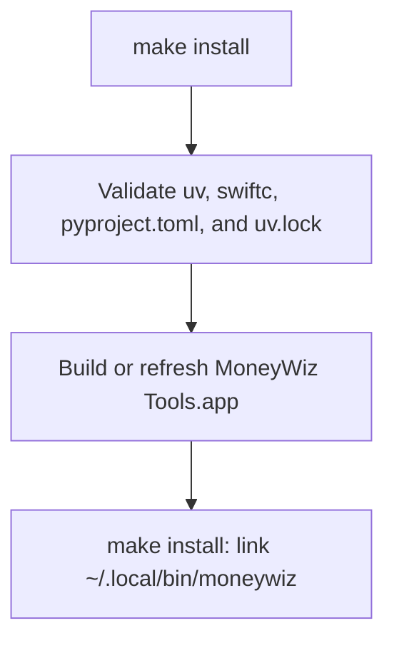

# Bundle Installation

## Purpose

The installer produces a relocatable **MoneyWiz Tools.app** and installs
small command symlinks in `~/.local/bin`. The app bundle contains the Python
runtime, dependencies, scripts, API code, and Core Data host required at
runtime.

The source checkout, `uv`, and `swiftc` are build-time requirements only.

## Installation workflow



## Prerequisites

- macOS.
- `swiftc`, normally supplied by Xcode Command Line Tools.
- `uv`.
- This repository with `pyproject.toml` and `uv.lock`.

Run `make` to print the available targets and their short descriptions.

## Install commands

```sh
make install
```

`make install` installs the app bundle and the `moneywiz` command. It also
removes a legacy `moneywiz-cli` symlink.

The default app location is:

```text
~/Applications/MoneyWiz Tools.app
```

Choose another parent directory before installation:

```sh
make configure-install-dir APP_BUNDLE_DIR="$HOME/LocalApps"
make install
```

The chosen location is persisted in the user configuration used by Make.
Ensure `~/.local/bin` is on `PATH`.

## Runtime layout

```text
MoneyWiz Tools.app/
  Contents/
    MacOS/MoneyWizTools
    Resources/runtime/
      python/
      .venv/
      scripts/
```

The shell entrypoints resolve their target inside this bundle. An installed
command therefore does not use the repository path that created it.

## Update and removal

Re-run the relevant install target after changing the source:

```sh
make install
```

`make install` refreshes the `moneywiz` symlink.

Removal is destructive to the installed bundle and both symlinks:

```sh
make uninstall
```

`make clean` currently has the same removal effect. Do not use it as a
routine source-tree cleanup command.

## Troubleshooting

| Symptom | Check |
| --- | --- |
| Command not found | Add `~/.local/bin` to `PATH`, then run the matching install target. |
| Build cannot find `swiftc` | Install Xcode Command Line Tools. |
| Build cannot find `uv` | Install `uv` in the build environment. |
| Build cannot find `uv.lock` | Regenerate the lockfile from `pyproject.toml` during development, then commit it with the dependency change. |
| Command resolves into a deleted checkout | Re-run the relevant install target; the symlink should target the app bundle. |
