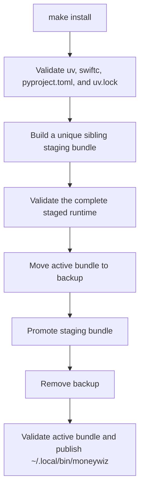

# Bundle Installation

## Purpose

The installer produces a relocatable **MoneyWiz Tools.app** and installs
small command symlinks in `~/.local/bin`. The app bundle contains the Python
runtime, dependencies, scripts, API code, and Core Data host required at
runtime.

The source checkout, `uv`, and `swiftc` are build-time requirements only.

## Installation workflow



## Prerequisites

- macOS.
- `swiftc`, normally supplied by Xcode Command Line Tools.
- Git and a Git worktree for selecting the tracked product payload.
- `uv`.
- This repository with `pyproject.toml` and `uv.lock`.

Run `make` to print the available targets and their short descriptions.

## Install commands

```sh
make install
```

`make install` installs the app bundle and the `moneywiz` command. It also
removes a legacy `moneywiz-cli` symlink. All build work happens in a unique
sibling staging directory on the bundle filesystem. A failed build leaves the
active bundle and command symlink unchanged. If promotion fails after the
active bundle is moved aside, the installer restores that backup. If the
process is forcibly terminated in that interval, the next build restores the
backup before checking build dependencies. The bundled virtual environment
uses a relative interpreter link so it remains valid after staging is promoted.

The staged script payload comes from one explicit positive product manifest;
validation rejects both missing and additional files under `runtime/scripts/`.
Tracked documentation is selected and copied separately, and the launcher and
configuration example are explicit runtime roots. The builder copies current
worktree contents without reading file contents from the Git index. It never
copies development helpers, build inputs, `tests/`, or untracked and ignored
artifacts such as local databases, SQLite sidecars, logs, or Python caches into
the product bundle.

The default app location is:

```text
~/Applications/MoneyWiz Tools.app
```

Choose another parent directory before installation:

```sh
make configure-install-dir APP_BUNDLE_DIR="$HOME/LocalApps"
make install
```

The chosen location is persisted in the user configuration used by Make.
Ensure `~/.local/bin` is on `PATH`.

## Runtime layout

```text
MoneyWiz Tools.app/
  Contents/
    MacOS/MoneyWizTools
    Resources/runtime/
      python/
        managed/
        venv/
      scripts/
      doc/
```

The shell entrypoints resolve their target inside this bundle. An installed
command therefore does not use the repository path that created it.
`moneywiz --version` and `moneywiz -V` read `Contents/Info.plist` before Python
or database initialization, so version reporting remains available when those
runtime resources are unavailable.
`create-test-db` and `sanitize-test-db` are source-checkout-only development
commands and fail clearly when requested through the installed dispatcher.

Installed schema exports default to the user-writable directory
`${XDG_DATA_HOME:-$HOME/.local/share}/moneywiz-tools/schema`. Explicit
`--out-md` and `--out-json` paths remain authoritative. The source dispatcher
continues to default to the checkout's `doc/` directory.

## Update and removal

Re-run the relevant install target after changing the source:

```sh
make install
```

`make install` and `make reinstall` use the same rollback-safe upgrade path;
neither removes the active bundle before the replacement is complete. The
installer validates the promoted bundle again before atomically refreshing the
`moneywiz` symlink.

Removal is destructive to the installed bundle and both symlinks:

```sh
make uninstall
```

`make clean` currently has the same removal effect. Do not use it as a
routine source-tree cleanup command.

## Troubleshooting

| Symptom | Check |
| --- | --- |
| Command not found | Add `~/.local/bin` to `PATH`, then run the matching install target. |
| Build cannot find `swiftc` | Install Xcode Command Line Tools. |
| Build cannot find `uv` | Install `uv` in the build environment. |
| Build cannot find `uv.lock` | Regenerate the lockfile from `pyproject.toml` during development, then commit it with the dependency change. |
| Command resolves into a deleted checkout | Re-run the relevant install target; the symlink should target the app bundle. |
