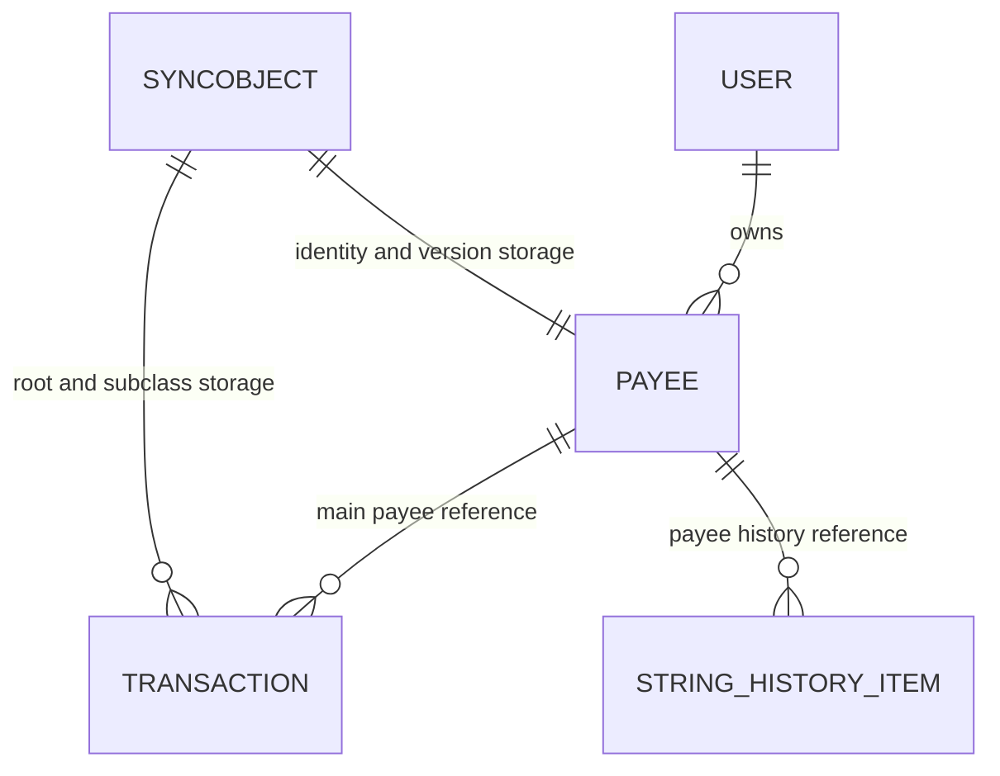

# Entity Relationship Diagram

## Scope

This is a logical relationship diagram for the observed live payee profile.
MoneyWiz uses Core Data inheritance, so the physical rows are not a
one-table-per-logical-entity relational design.

## Observed physical mappings

| Logical concept | Live storage | Important fields |
| --- | --- | --- |
| Payee | `ZSYNCOBJECT` row with `Z_ENT = 29` | `Z_PK`, `ZGID`, `Z_OPT`, `ZNAME5`, `ZUSER7` |
| Transaction | `ZSYNCOBJECT` root and subclass rows with `Z_ENT = 37` through `48` | `ZPAYEE2` on applicable transaction rows |
| Payee history | `ZSTRINGHISTORYITEM` | `ZPAYEE`, `ZSTRING` |
| Identity allocation | `ZSYNCOBJECT` and Core Data lifecycle | Do not allocate with `Z_PRIMARYKEY.Z_MAX` |

The exact duplicate merger enumerates every active Core Data relationship whose
destination is `Payee`. `ZPAYEE2` and `ZSTRINGHISTORYITEM.ZPAYEE` are the
visible confirmed examples; updating only `ZPAYEE2` is incomplete.

## Version boundary

The numbers and column suffixes above are confirmed for
MoneyWizDataModel 48. Test fixtures use different entity numbers and are not
a source of truth for the live store.

See [Live Payee Structure](LIVE-PAYEE-STRUCTURE.md) for the detailed profile
and [Sync Object Model](SYNCOBJECT.md) for object lifecycle constraints.
